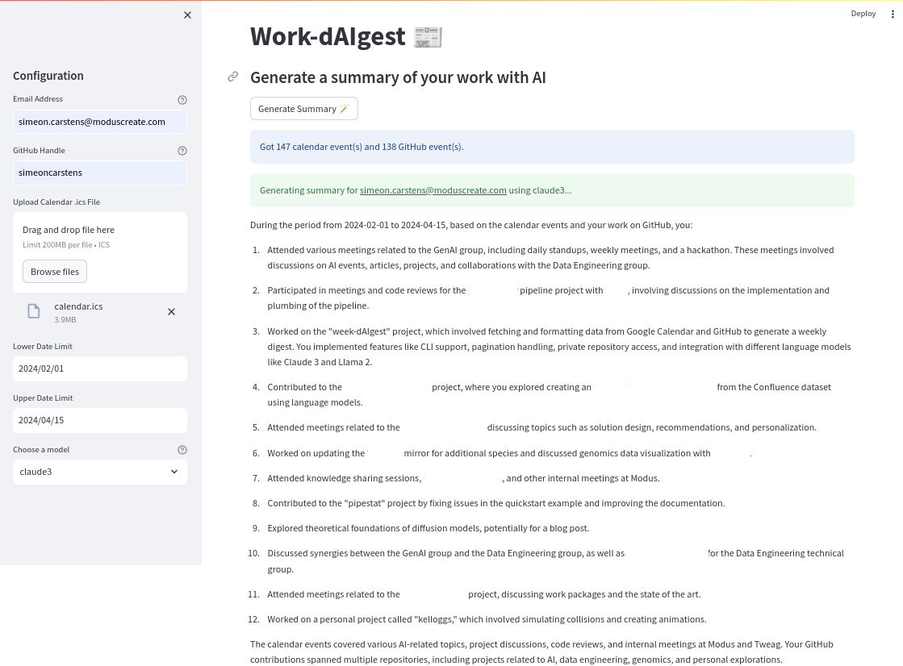

# Summarize your work using a LLM

This project came into existence as part of a Tweag-internal hackathon on GenAI topics.
The goal is to summarize your work using data from multiple work-related sources, such as
- GitHub,
- Google Calendar,
- Slack,
- Jira,
- ...

Right now, supported data sources are GitHub and Google Calendar.
With these sources, the program yields a nice summary text, for example (in the UI):

[](./images/demo.png)

## Getting the data

### GitHub data

GitHub data (issues, PRs, commits) is retrieved automatically using the code in `work_daigest/fetchers/github.py`, but follow instructions in the [fetchers README](work_daigest/fetchers/README.md) of you'd like to manually fetch the data and inspect it.

### Google Calendar data

Currently, Google Calendar data needs to be exported manually into an `.ics` file.
To do that, open Google Calendar in your browser, then go to "Settings" (the cogwheel symbol) -> "Import & export" and click the "Export" button.
This downloads a zipped `.ics` file, which you will have to unpack.

## Usage

### Set up the software environment

To get started, install the program in a virtual environment using `nix-shell` if you're a Nix person.
If you're not, you'll have to have [Poetry](https://python-poetry.org/) installed.
Then, you can just run `poetry install` to install the application and all required dependencies and you're ready to go.

### Configure AWS Bedrock and AWS credentials

The application currently calls out to [AWS Bedrock](https://aws.amazon.com/bedrock/) for LLM access.
So you'll have to enable the relevant models (default is Claude-3 Sonnet) in Bedrock.

Once that is done, make sure that you have local AWS credentials with all necessary permissions set up, for example using `aws sso configure` and `aws sso login`.
Don't forget to set the `AWS_PROFILE` environment variable to your AWS profile name if it's not the default.

### Configure GitHub (optional)

If you want data from private GitHub repositories be included in the summary, you need to set up a GitHub personal token.
The program expects a (classic) GitHub personal token in the environment variable `GITHUB_TOKEN`.
That token needs to have the full `repo` OAuth scopes.


### CLI
Run `work-daigest --help` to learn about the supported command line arguments:
```console
$ GITHUB_TOKEN=<your GitHub token> work-daigest --help
usage: work-daigest [-h] --calendar-data CALENDAR_DATA --github-handle GITHUB_HANDLE --email EMAIL [--lower-date LOWER_DATE] [--upper-date UPPER_DATE]
                    [--model {jurassic2,llama2,claude3}]

Generate a summary of your work

options:
  -h, --help            show this help message and exit
  --calendar-data CALENDAR_DATA
                        Path to the calendar .ics file
  --github-handle GITHUB_HANDLE
                        GitHub handle to use when fetching GitHub data
  --email EMAIL         Email address to use when filtering calendar events
  --lower-date LOWER_DATE
                        Lower date limit to consider data for, in the format YYYY-MM-DD. Defaults to today - 7 days.
  --upper-date UPPER_DATE
                        Upper date limit to consider data for, in the format YYYY-MM-DD. Defaults to today.
  --model {jurassic2,llama2,claude3}
                        Model to use for summary generation
```

### Streamlit UI
You can also run the Streamlit UI by running the following, then opening the URL
that Streamlit prints in your browser:
```console
streamlit run work_daigest/ui.py
```
